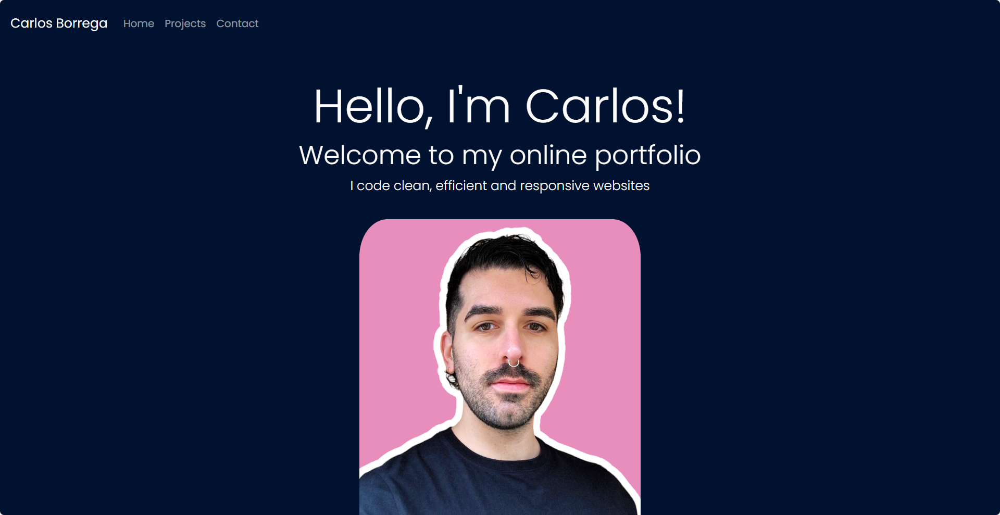

# React Portfolio Website

## Overview

This is a React-based portfolio website designed to showcase your skills, projects, and professional experience. The website includes dynamic routing using React Router and consists of several components to display relevant information and projects.



## Deployment

The deployed version can be accessed [here](https://master--carlos-react-portfolio.netlify.app/).

## Tech Stack

- React
- React Router

## Features

### App

- The top-level component responsible for rendering all necessary child components.

### Header

- Rendered across every page component of the site.
- Contains a Navbar for easy navigation.

### Home Page

- A welcoming landing page that includes:
  - Your Name
  - A headshot of you (or an avatar)
  - Your brand statement
  - Some indication that this is your portfolio site

### Projects Page

- Dynamically renders six instances of the Project component.
- Project details are stored in a JSON file and imported into your project.

### Project Component

- A reusable component that ingests JSON data as props.
- Utilises Router props to properly render the right project based on user selection.
- Renders the following information for each project:
  - Project title
  - Link to the deployed version
  - Link to the GitHub repository
  - GIF or screenshot of the deployed application

### Contact Page

- Includes contact information:
  - Email address
  - Link to a PDF version of your CV
  - Link to your GitHub profile
  - Link to your LinkedIn page
- Features a contact form for handling events.

These features collectively create a comprehensive and dynamic portfolio website using React, ensuring an engaging user experience and easy navigation.

## Getting Started

1. **Clone the repository**

   ```console
   git clone https://github.com/borregaio/react-portfolio
   ```

2. **Install dependencies**

   ```console
   npm install
   ```

3. **Start the development server**

   ```console
   cd react-portfolio
   npm start
   ```

4. **Review**
   - Open your web browser and navigate to http://localhost:3000 to view the React portfolio.

## Steps Followed

- **The top-level App component responsible for rendering all necessary child components.**

    ```javascript
    const App = () => {
      return (
        <Router>
          <div>
            <Routes>
              <Route path="/" element={<Home />} />
              <Route path="/projects" element={<Projects />} />
              <Route path="/contact" element={<Contact />} />
            </Routes>
          </div>
        </Router>
      );
    };
    ```

- **The Header rendered across every page component of the site.**

    ```javascript
    import Header from './Header';
    ```

- **The Header contains a Navbar for easy navigation.**

    ```javascript
    const Header = () => {
      return (
        <header>
          <nav className="navbar navbar-expand-lg navbar-dark p-3">
            <Link className="navbar-brand" to="/">Carlos Borrega</Link>
            <button className="navbar-toggler" type="button" data-bs-toggle="collapse" data-bs-target="#navbarNav" aria-controls="navbarNav" aria-expanded="false" aria-label="Toggle navigation">
              <span className="navbar-toggler-icon"></span>
            </button>
            <div className="collapse navbar-collapse" id="navbarNav">
              <ul className="navbar-nav">
                <li className="nav-item active">
                  <Link className="nav-link" to="/">Home</Link>
                </li>
                <li className="nav-item">
                  <Link className="nav-link" to="/projects">Projects</Link>
                </li>
                <li className="nav-item">
                  <Link className="nav-link" to="/contact">Contact</Link>
                </li>
              </ul>
            </div>
          </nav>
        </header>
      );
    };
    ```

- **A welcoming landing page that includes:**
  - Your Name
  - A headshot of you (or an avatar)
  - Your brand statement
  - Some indication that this is your portfolio site

    ```javascript
    const Home = () => {
      return (
        <div>
          <Header />
          <div className="jumbotron container-fluid p-5 home">
            <h1 className="display-2">Hello, Im Carlos!</h1>
            <h2 className="display-6">Welcome to my online portfolio</h2>
            <p className="lead">I code clean, efficient and responsive websites</p>
            
          </div>
        </div>
      );
    };
    ```

- **The Projects page dynamically renders six instances of the Project component.**

    ```javascript
    const Projects = () => (
      <div>
        <Header />
        <div className="container-fluid projects">
        <h1 className="m-5">Projects</h1>
        {projectsData.map(project => (
          <Project key={project.id} {...project} />
        ))}
        </div>
      </div>
    );
    ```

- **Project details are stored in a JSON file and imported into your project.**

    ```javascript
        {
        "id": 1,
        "title": "Work Day Scheduler",
        "deployedLink": "https://borregaio.github.io/workday-scheduler/",
        "githubLink": "https://github.com/borregaio/workday-scheduler",
        "screenshot": "https://i.ibb.co/tH6v5cv/3.png"
        },
    ```

- **A reusable Project component that ingests JSON data as props.**

    ```javascript
    const Project = (props) => (
      <div className="card m-5 border-0">
        
        <div className="card-body">
          <h5 className="card-title">{props.title}</h5>
          <Link to={props.githubLink} className="btn btn-success m-1">
            GitHub repository
          </Link>
          <Link to={props.deployedLink} className="btn btn-success m-1">
            Live site
          </Link>
        </div>
      </div>
    );
    ```

- **The Contact page includes contact information:**
  - Email address
  - Link to a PDF version of your CV
  - Link to your GitHub profile
  - Link to your LinkedIn page

    ```javascript
            <div className="list-group m-5" style={{ maxWidth: "300px" }}>
              <Link to="mailto:c.borrega@proton.me" className="list-group-item list-group-item-action" aria-current="true">
                c.borrega@proton.me
              </Link>
              <Link to="https://drive.google.com/file/d/1AfhdNU2lRLLAt0Rf49UK2_zbpZejf63X/view?usp=sharing" download="resume.pdf" className="list-group-item list-group-item-action" aria-current="true">
                Download my resume
              </Link>
              <Link to="https://www.linkedin.com/in/carlosborrega/" className="list-group-item list-group-item-action" aria-current="true">
                LinkedIn
              </Link>
              <Link to="https://github.com/borregaio" className="list-group-item list-group-item-action" aria-current="true">
                GitHub
              </Link>
            </div>
    ```

- **Features a contact form for handling events.**

    ```javascript
            <form onSubmit={handleSubmit} className="m-5" style={{ maxWidth: "300px" }}>
              <div className="form-group p-2">
                <label htmlFor="name">Name:</label>
                <input
                  type="text"
                  className="form-control"
                  id="name"
                  name="name"
                  placeholder="Enter your name"
                  value={formData.name}
                  onChange={handleChange}
                />
              </div>

              <div className="form-group p-2">
                <label htmlFor="exampleInputEmail1">Email address:</label>
                <input
                  type="email"
                  className="form-control"
                  id="exampleInputEmail1"
                  name="email"
                  aria-describedby="emailHelp"
                  placeholder="Enter email"
                  value={formData.email}
                  onChange={handleChange}
                />
              </div>

              <div className="form-group p-2">
                <label htmlFor="message">Message:</label>
                <textarea
                  className="form-control"
                  id="message"
                  name="message"
                  rows="3"
                  placeholder="Enter your message"
                  value={formData.message}
                  onChange={handleChange}
                ></textarea>
              </div>

              <button type="submit" className="btn btn-success m-2">
                Submit
              </button>
            </form>
    ```